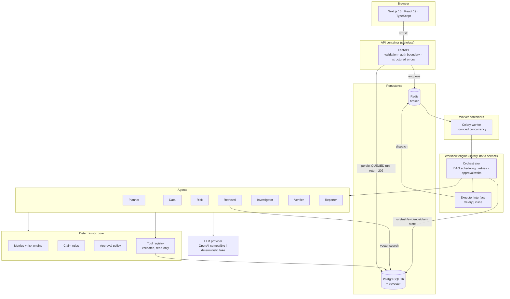
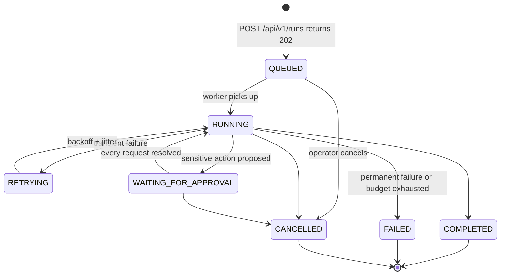
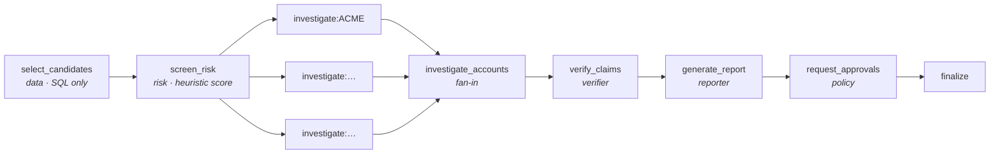
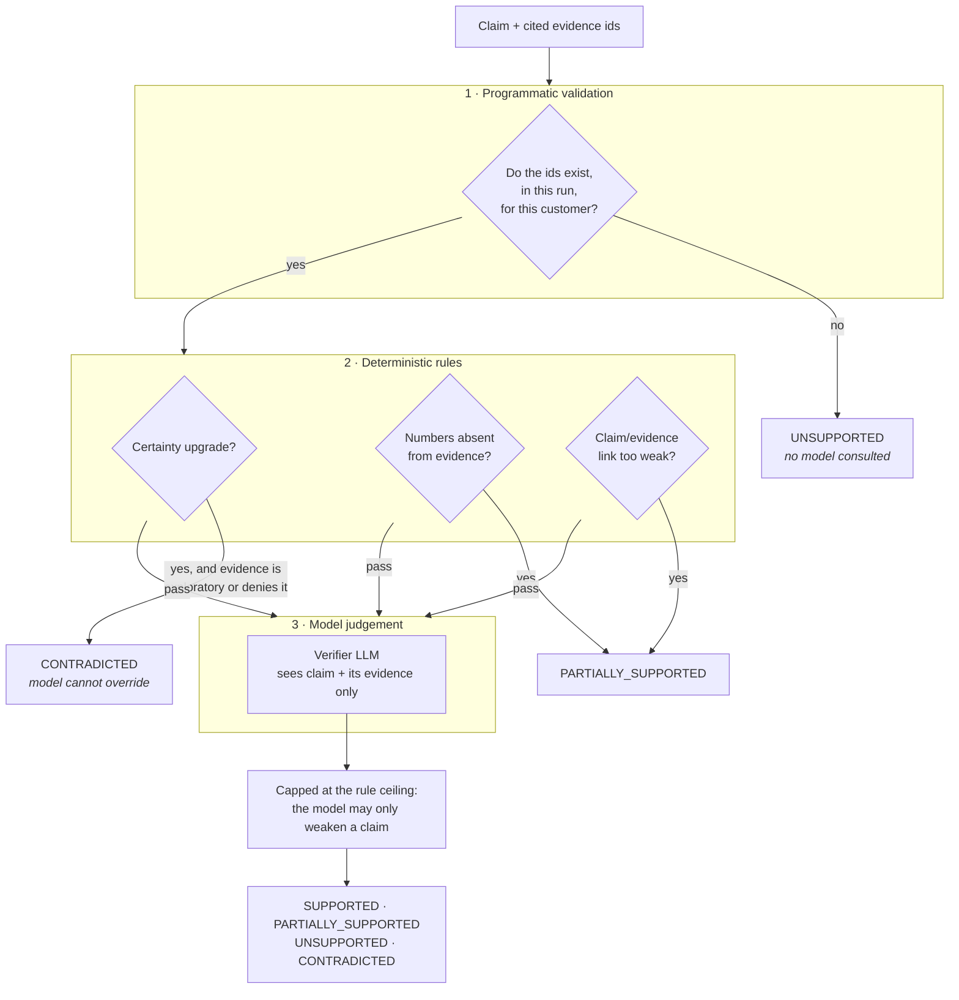
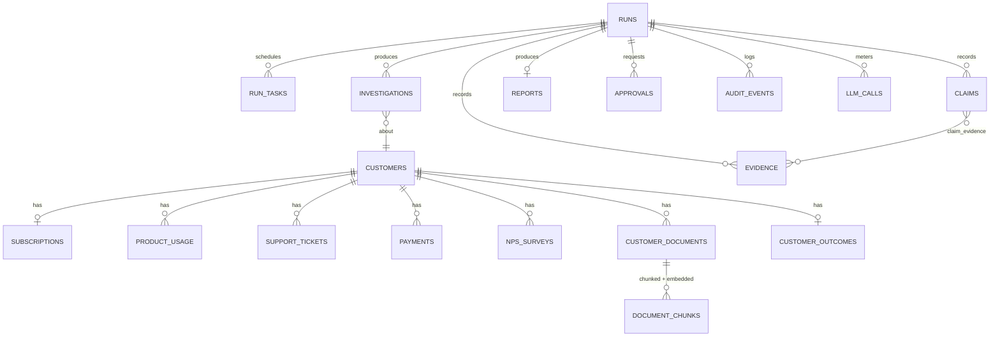

# Veriflow

**Enterprise AI investigation and agent-orchestration platform.** You give it a
business objective; it returns an evidence-backed report in which every factual
statement has been verified against a specific source, and nothing
customer-facing happens without a human saying yes.

```
Objective → Planner → Task DAG → Orchestrator → Agents → Retrieval → Risk →
Investigation → Claims → Independent verification → Report → Human approval → Done
```

The first implemented domain is **B2B SaaS churn investigation**. The
architecture is domain-agnostic underneath.

---

## Contents

- [The problem](#the-problem)
- [What makes it trustworthy](#what-makes-it-trustworthy)
- [Quick start](#quick-start)
- [Architecture](#architecture)
- [The workflow](#the-workflow)
- [Agents](#agents)
- [Evidence and verification](#evidence-and-verification)
- [Human approval](#human-approval)
- [Data model](#data-model)
- [The synthetic dataset](#the-synthetic-dataset)
- [Evaluation results](#evaluation-results)
- [Reliability](#reliability)
- [Observability](#observability)
- [Security](#security)
- [Frontend](#frontend)
- [Testing](#testing)
- [Environment variables](#environment-variables)
- [Developer commands](#developer-commands)
- [Engineering tradeoffs](#engineering-tradeoffs)
- [Limitations](#limitations)
- [Roadmap](#roadmap)

---

## The problem

A customer-success leader at a B2B SaaS company has 3,000 accounts and 250
renewals in the next quarter. The questions that matter are:

> Which of these accounts are we about to lose, *why*, and what should we do
> about each one?

Answering that means joining usage telemetry, support history, billing status
and survey scores against things only written down in prose — a CSM note saying
the executive sponsor left, an email mentioning a competitor.

An LLM is genuinely good at the prose half. It is also happy to tell you an
account "has decided to cancel" when the email said they were "evaluating
alternatives". In a retention workflow that single upgrade of certainty is the
difference between a useful tool and one nobody trusts twice.

**Veriflow is built around that failure mode.** Deterministic code owns the
arithmetic, the ranking and the policy. The model is used where judgement
genuinely helps. Everything the model asserts is checked against the evidence it
cited, by a separate pass, before anyone reads it.

---

## What makes it trustworthy

| Concern | How it is handled |
|---|---|
| **Hallucinated facts** | Every material claim cites evidence by id. Ids are validated against the rows actually retrieved for that run *and that customer* — a fabricated `EV-99` is stripped and the claim dropped before verification even runs. |
| **Certainty inflation** | Deterministic rules detect a claim asserting a settled decision the evidence does not support, and can veto the model. "Evaluating alternatives" never becomes "decided to cancel". |
| **Invented numbers** | All arithmetic, date maths, ranking and scoring happen in Python. Numbers are handed to the model as inputs; a number in a claim that is absent from the evidence downgrades the claim. |
| **Prompt injection** | Retrieved documents are untrusted. Instruction-like spans are detected, neutralised, recorded as audit events, and rendered only inside a delimited data block. Agents have no write tools. |
| **Unsafe actions** | Whether an action needs approval is deterministic application logic. An LLM picks an action *type*; it can never decide review is unnecessary. |
| **Silent failure** | Invalid structured output is never accepted. The model is re-prompted with the validation error, then the task fails with a clear reason. |
| **Fake dashboards** | Every number in the UI is read from the database. With no runs, the dashboard shows zeros and nulls, not illustrative data. |

A rejected claim is not hidden. The run detail and the report both list what the
system **refused to conclude**, and why:

> ~~Acme Corp has decided to cancel their contract at renewal.~~
> **Excluded (CONTRADICTED):** The claim asserts "has decided to cancel" as
> settled fact. The evidence explicitly records that this has not happened, so
> the claim overstates what the source says.

---

## Quick start

Requires Docker, and ~2 GB of free disk for the images.

```bash
git clone <this-repo> && cd AgenticAIPlatform
cp .env.example .env          # works as-is; no API key needed
make up                       # builds and starts the full stack, runs migrations
make seed                     # generates 3,000 customers (~17s)
```

Then open:

| | |
|---|---|
| Frontend | <http://localhost:3000> |
| API docs | <http://localhost:8000/docs> |
| Health | <http://localhost:8000/health> |

In the UI: **New investigation** → keep the default objective → **Start
investigation**. The run queues immediately, workers execute it, and the page
streams real state. It will pause at **Approvals**; approve or reject there and
it completes.

Prefer the terminal?

```bash
make demo        # submits the objective, follows it, approves, prints the result
make evaluate    # runs the evaluation harness and prints the metrics
```

### No API key required

The default `LLM_PROVIDER=fake` is a **deterministic local model** — a scripted
provider that derives its output from the real inputs it is given (computed risk
signals, retrieved evidence, the verification rules). It is not a stub returning
fixed strings: it is what makes the entire platform, including the whole test
suite, runnable and reproducible offline at zero cost.

For live inference:

```bash
# .env
LLM_PROVIDER=openai
OPENAI_API_KEY=sk-...
EMBEDDING_PROVIDER=openai   # optional; re-run `make reseed` to re-embed
```

Any OpenAI-compatible gateway works via `OPENAI_BASE_URL`.

---

## Architecture



**Why the engine is a library.** All orchestration logic — dependency
scheduling, retry accounting, cancellation, approval parking, run settlement —
lives in `app/orchestration/engine.py` and depends on an `Executor` interface,
never on Celery. Celery is one implementation; `InlineExecutor` is another, and
is what the test suite drives. Swapping in Temporal means writing a third
executor, not rewriting the workflow.

### Layout

```
backend/
  app/
    agents/          planner · data · risk · retrieval · investigator · verifier · reporter
    analytics/       metrics.py (deterministic maths) · risk.py (score) · claim_rules.py (verification)
    api/v1/          customers · runs · approvals · evaluations · dashboard · health
    core/            config · logging · errors · retry · telemetry · failure_injection · clock
    db/              engine + session management
    evaluation/      harness and CLI
    llm/             provider interface · OpenAI · deterministic fake · embeddings · client
    models/          SQLAlchemy models + enums
    orchestration/   engine · dag · executor · stages
    policy/          approvals.py (deterministic sensitive-action policy)
    rag/             chunking · ingest · retrieval · sanitize
    repositories/    validated data access
    seed/            synthetic data generator (personas, documents)
    tools/           tool registry + customer tools
    workers/         celery app + tasks
  alembic/versions/  migrations
  tests/             unit · integration · agents · e2e
frontend/
  src/app/           dashboard · runs · customers · reports · approvals · evaluation · system
  src/components/    shell · ui primitives · charts · run views
  src/lib/           typed API client · hooks · formatting
docs/                architecture · agents · workflow · data-model · evaluation · security · deployment · frontend
```

---

## The workflow



The task graph, with the per-account fan-out created at runtime:



What happens, in order:

1. **`POST /api/v1/runs`** validates the objective, resolves structured
   parameters deterministically, persists a `QUEUED` run and returns `202`. The
   HTTP request never waits for the investigation.
2. **Planner** produces an `ExecutionPlan`, validated against the agents and
   task ids that actually exist — no unknown agents, no cycles, no duplicate
   ids, no invented capabilities, within the task limit.
3. **`select_candidates`** finds accounts renewing in the window via indexed
   SQL. No model chooses which accounts to look at.
4. **`screen_risk`** scores every candidate with the deterministic heuristic,
   ranks them, and selects the top *N* above the threshold. It then creates one
   `investigate:<account>` task per selection and wires the aggregator to them —
   parallelism is a property of the persisted graph.
5. **Each `investigate:*` task** gathers structured metrics, retrieves semantic
   evidence, persists both, and asks the investigator for cited claims.
   Concurrency is bounded by `MAX_PARALLEL_INVESTIGATIONS`. One account failing
   does not strand the run.
6. **`verify_claims`** checks every claim independently.
7. **`generate_report`** assembles the report from verified material only.
8. **`request_approvals`** applies the deterministic policy and parks the run.
9. **`finalize`** closes the run once every request is resolved.

---

## Agents

Each agent is a *declared capability*: a name, a role, an explicit tool
allow-list, a typed output schema, a timeout, a retry budget. Enforced in code,
not in a prompt. There is no dynamic capability acquisition and no agent-to-agent
chatter.

| Agent | LLM? | Output schema | Tools | What it owns |
|---|---|---|---|---|
| **Planner** | yes | `ExecutionPlan` | none | Objective → validated task DAG |
| **Data** | **no** | typed dataclasses | 7 read-only | Candidate selection, metric collection |
| **Risk** | **no** | `RiskAssessment` | `get_risk_signals` | Deterministic score + ranking |
| **Retrieval** | **no** | `EvidenceSet` | 3 read-only | pgvector search, evidence persistence, injection defence |
| **Investigator** | yes | `InvestigationResult` | 8 read-only | Interpretation, cited claims, recommended actions |
| **Verifier** | yes | `VerificationBatch` | **none** | Independent claim verification |
| **Reporter** | yes | `ReportNarrative` | **none** | Prose only — the app assembles the facts |

Three of the seven use no model at all. That is deliberate: candidate selection,
scoring and ranking are cheaper, faster, reproducible and auditable in code, and
nothing is gained by asking a model to do arithmetic.

The reporter is restricted to `ReportNarrative` — a title, a summary and per-
account prose. Scores, rankings, evidence references and the supported/rejected
split are assembled by the application from verified rows, so the reporter
cannot reorder accounts, invent a figure, or resurrect a rejected claim.

### Tool boundary

```
get_customer_profile   get_subscription      get_usage_summary
get_support_summary    get_payment_summary   get_nps_history
find_upcoming_renewals get_risk_signals      search_customer_documents
get_document           list_customer_documents
propose_customer_action   ← the only SENSITIVE_WRITE tool; creates an approval record, never acts
```

Every tool declares a validated Pydantic input model, a typed output model, an
access class, a timeout and a retry policy. There is deliberately **no SQL tool,
no shell tool, no filesystem tool and no arbitrary-HTTP tool** — a model cannot
author a query. A per-task tool-call budget prevents runaway loops.

---

## Evidence and verification

### The evidence model

Two kinds of evidence are recorded per investigation, both fully attributable:

- **Document chunks** retrieved from pgvector — chunk id, document id, source
  type, source date, raw content, cosine relevance, customer id.
- **Metric records**, one per deterministic risk signal, so a calculated claim
  has something concrete to cite instead of unverifiable prose.

Each gets a short handle (`EV-1`, `EV-2`, …) that agents cite. Handles are
allocated **per customer**, which is both more readable and race-free: one
account is investigated by exactly one task, so no locking is needed.

### Verification is a pipeline, not a question



Design decisions worth calling out:

- **A rule veto is final.** If the rules say CONTRADICTED and the model says
  SUPPORTED, the claim stays CONTRADICTED. The model can only make a claim
  weaker, never stronger.
- **Inferences are judged differently from facts.** "Active users fell 47.5%"
  must match its evidence almost word for word. "The account appears to be at
  elevated churn risk, driven by that decline" is an *interpretation* — it
  legitimately uses words no source document contains. Judging it on term
  overlap would reject exactly the reasoning the product exists to produce. So
  inferences must be hedged, must cite real evidence, and must not upgrade
  certainty — but are not required to echo the source's vocabulary.
- **Negation is handled.** Account notes routinely record the *absence* of an
  event ("nothing in the record indicates they have cancelled"). Reading that as
  evidence of cancellation inverts the document's meaning and silently disables
  the strongest guardrail in the system, so negated matches do not count.
- **Partially supported claims are reported, not dropped.** They appear as
  *qualified findings* with their qualifier attached. "The evidence points this
  way but does not prove it" is useful to a reader; silence is not.
- **Only SUPPORTED claims become asserted conclusions.**

---

## Human approval

Approval policy is **deterministic application logic** in
`app/policy/approvals.py`. An LLM selects an action type from a fixed catalogue;
it has no say in whether review is required.

| Requires approval | Executes without approval |
|---|---|
| `SEND_CUSTOMER_EMAIL` | `INTERNAL_REVIEW` |
| `OFFER_DISCOUNT` | `SCHEDULE_INTERNAL_MEETING` |
| `UPDATE_CRM_RECORD` | `MONITOR_USAGE` |
| `CHANGE_SUBSCRIPTION` | `PREPARE_BRIEFING` |
| `ESCALATE_TO_EXECUTIVE` | `ASSIGN_OWNER` |
| `SCHEDULE_CUSTOMER_CALL` | |

`WorkflowMode` can tighten this further: `REVIEW_ALL` gates everything,
`READ_ONLY` permits no action at all.

When anything needs approval the run moves `RUNNING → WAITING_FOR_APPROVAL` and
stops. Approval state lives in PostgreSQL, so it survives worker and API
restarts — a fresh process resumes the run correctly. Requests are idempotent:
a retried task cannot open a second identical approval. Deciding twice returns
`409 already_resolved` rather than overwriting someone else's review.

Rejection is a decision, not a failure: the run **completes**, the rejection is
recorded with its reviewer and comment, the report still stands, and the action
simply is not taken.

---

## Data model



21 tables, created by Alembic migrations (never `create_all`). Constraints are
real: `CHECK` constraints on every enum column, foreign keys with explicit
`ON DELETE` behaviour, composite indexes for the hot query paths, and natural
unique keys that make writes idempotent —
`(run_id, customer_id, source_id)` for evidence, `(run_id, claim_key)` for
claims, `(run_id, customer_id)` for investigations,
`(run_id, idempotency_key)` for approvals.

An HNSW index on `document_chunks.embedding` (`vector_cosine_ops`) serves
semantic search.

---

## The synthetic dataset

`make seed` generates **3,000 customers in ~17 seconds** with no LLM calls and
no network. Deterministic: the same `SEED_RANDOM_SEED` produces a byte-identical
dataset, which is what makes evaluation numbers comparable across commits.

| | |
|---|---|
| Customers | 3,000 |
| Churned | 450 |
| Renewed | 2,147 |
| Downgraded / expanded | 51 / 51 |
| Live, renewal ahead | 301 (252 renewing within 90 days) |
| Weekly usage observations | 78,000 |
| Support tickets | ~23,000 |
| Documents / chunks | ~9,650 |
| Documents with an embedded prompt-injection attempt | ~47 |

### Correlated personas, not random noise

Twelve personas each specify how usage, support, billing and sentiment move
*together*, which documents the account produces, and how likely it was to
churn:

`USAGE_DECLINE` · `SUPPORT_FRUSTRATION` · `PRICING_PRESSURE` ·
`COMPETITOR_EVALUATION` · `POOR_ONBOARDING` · `MISSING_FEATURE` ·
`SPONSOR_LOST` · `BILLING_PROBLEMS` · `HEALTHY_EXPANDING` ·
`HEALTHY_TEMPORARILY_INACTIVE` · `FALSE_POSITIVE_SUPPORT_SPIKE` ·
`QUIET_DISENGAGEMENT`

The dataset is deliberately hard:

- `FALSE_POSITIVE_SUPPORT_SPIKE` looks alarming quantitatively (ticket volume
  nearly 4×) and **renews** — the explanation is in a note about a 180-user
  rollout.
- `QUIET_DISENGAGEMENT` looks **fine** quantitatively and churns; the signal
  exists only in the documents (missed QBRs, unanswered outreach).
- `HEALTHY_TEMPORARILY_INACTIVE` has a real usage dip with a benign, documented
  cause.
- Healthy accounts carry occasional complaints; at-risk accounts carry positive
  notes. Evidence is often ambiguous.

Two further properties keep it honest. **Outcomes are assigned by a stratified
plan**, so the class balance is exact rather than emergent. And **signal severity
is conditioned on the outcome** — two accounts can both be "support frustration"
stories, but the one that renewed is the one whose tickets got resolved, so its
signals are milder. Without that, the data would claim a CSAT of 2.2 with tripled
ticket volume is only 29% predictive of churn, which is not true of real
portfolios and unfairly handicaps any screening model.

### The demo account

`CUST-000001` — **Acme Corp** — is pinned, not sampled: Enterprise, $8,200 MRR,
renewal ~31 days out, 90-day DAU ≈ 82 falling to ≈ 43, support tickets 3 → 11,
NPS 8 → 3, latest invoice 38 days overdue, and an email that says

> "we are evaluating alternative platforms. Competitor X … quoted meaningfully
> below our current spend."

The platform scores it **96.2/100 — CRITICAL**. It reports that Acme *is
evaluating alternatives*, and it **rejects** the claim that Acme *has decided to
cancel*.

---

## Evaluation results

`make evaluate` computes everything below from the database. Nothing is
hard-coded.

> **These are synthetic-data results.** They measure this implementation on a
> dataset this repository generates. They are not a claim about real-world churn
> prediction. The risk model is a transparent weighted heuristic — it was never
> fitted on data.

Measured on 800 labelled customers (21% churn base rate), each scored **as of
its own outcome date** so the model only ever sees pre-outcome behaviour, and
never sees the outcome label:

### Ranking quality

| Metric | Value |
|---|---|
| ROC-AUC | **0.841** |
| Average precision | 0.650 |
| Precision @ top 10 | 0.90 |
| Precision @ top 25 | 0.96 |
| Precision @ top 50 | 0.82 |
| Recall @ top 50 | 0.244 |
| Lift @ top 5% | **3.93×** |
| Lift @ top 10% | 3.69× |
| Lift @ top 20% | 2.95× |
| Mean score, churned | 34.2 |
| Mean score, renewed | 15.4 |

AUC 0.84 rather than 0.99 is the point: the dataset contains deliberate
false positives and false negatives, so a hand-weighted heuristic should be
good, not magic.

### Retrieval quality

| Metric | Value |
|---|---|
| Customer scope precision | **1.000** |
| Risk-relevant chunk rate | 0.781 |
| Accounts where retrieval surfaced a risk signal | 0.920 |
| Mean cosine relevance (local embedder) | 0.03 |

Customer scope precision **must** be exactly 1.0 — anything less means the
customer filter leaked another account's documents, which is a security defect,
not a quality metric. Risk-relevant chunk rate is a keyword-overlap proxy, not
human-judged ground truth. The low absolute cosine values are expected with the
local hashed embedder: ranking carries the meaning, not magnitude.

### Verification quality

From a completed 5-account run (33 material claims):

| Metric | Value |
|---|---|
| Claims supported | 81.8% |
| Partially supported (reported with a qualifier) | 15.2% |
| Rejected (never asserted) | 3.0% |
| Unsupported **before** verification | 3.0% |
| Unsupported **after** verification | **0.0%** |
| Rejected claims leaking into a report | **0** |
| Invalid structured outputs | 0 |
| LLM calls / tokens / est. cost | 8 / 26,553 / $0.0074 |

The last two rows of the first group are the ones that matter: the gap between
"before" and "after" is the verification stage doing its job, and the report
integrity check confirms that no rejected claim appears as a conclusion
anywhere.

---

## Reliability

**Error taxonomy drives retries by type, not by string matching.** Everything
deriving from `TransientError` is retried with exponential backoff and full
jitter; everything deriving from `PermanentError` fails immediately. Unknown
exceptions are treated as *permanent* — a bug should surface as a clear failed
run rather than being retried three times and hidden.

| Retried | Not retried |
|---|---|
| LLM 429 / 5xx / timeout | invalid structured output |
| embedding service failure | invalid plan (unknown agent, cycle) |
| vector search failure | nonexistent customer |
| transient database error | unauthorised tool |
| external service timeout | unsupported objective |

Other reliability properties, each covered by tests:

- **Idempotent writes.** Natural unique keys mean a retried task updates rather
  than duplicating.
- **Duplicate delivery is a no-op.** Tasks are claimed with a conditional
  `UPDATE … WHERE status IN (…)`, so a second delivery finds nothing to claim.
- **Stale tasks are reclaimed.** A `RUNNING` task whose worker vanished is
  returned to `RETRYING`, or failed if out of budget, so a killed worker cannot
  strand a run.
- **Late results cannot resurrect a cancelled run.**
- **Failure isolation.** One account's investigation failing still produces a
  verified report for the others; all of them failing fails the run.
- **Failure handling survives a poisoned session.** A stage that dies mid-flush
  leaves its transaction unusable, so the outcome is always recorded through a
  fresh session. (This was a real bug: the handler used to raise while recording
  the failure, leaving the task `QUEUED` forever and the run hung.)
- **Bounded everything.** Plan tasks, tool calls per task, retrieval chunks,
  model retries, parallel investigations, prompt sizes, objective length,
  page sizes.

### Failure injection

Development-only fault simulation proves the recovery paths work rather than
asserting they exist. It is **hard-disabled when `APP_ENV=production`**,
regardless of the rates set.

```bash
FAILURE_INJECTION_ENABLED=true
LLM_FAILURE_RATE=0.3        # 429s, timeouts, malformed JSON
VECTOR_FAILURE_RATE=0.2     # vector search unavailable
```

---

## Observability

**Structured JSON logs** with correlation fields carried in `contextvars`, so
every record emitted during a task automatically carries `run_id`, `task_id`,
`customer_id`, `agent`, `tool` and `trace_id` without threading arguments
through every function.

```json
{"timestamp":"2026-10-08T01:46:14Z","level":"INFO","logger":"app.agents.investigator",
 "message":"investigation produced","run_id":"1289d0ed…","task":"investigate:CUST-000001",
 "agent":"investigator","customer_id":"143f8569…","claims":9,"dropped_claims":0,
 "invalid_reference_claims":0,"heuristic_score":92.2,"final_score":96.2}
```

Credential-looking values are redacted before they can reach a sink — but
precisely: `prompt_tokens` and `total_tokens` are *not* redacted, because
destroying the cost telemetry this system promises in the name of secret hygiene
is its own bug.

**OpenTelemetry** spans cover `workflow`, `planner`, `candidate_selection`,
`risk_screening`, `evidence_retrieval`, `customer_investigation`, `tool_call`,
`vector_search`, `llm_call`, `verification` and `report_generation`. Disabled by
default; set `OTEL_ENABLED=true` and `OTEL_EXPORTER_OTLP_ENDPOINT`.

**Langfuse** is optional and used through its documented HTTP ingestion
endpoint. Failures never affect a workflow. The platform works entirely without
it.

**Per-call metering.** Every LLM call records provider, model, operation,
prompt/completion tokens, latency, attempts, output validity and estimated cost
to the `llm_calls` table, surfaced on the run detail, dashboard and evaluation
pages.

---

## Security

The security effort is concentrated where the actual risk is — the agent and
tool boundary, and state integrity — rather than on building an identity
platform.

- **No SQL, shell, filesystem or arbitrary-HTTP tool exists.** Agents reach data
  only through validated repository methods.
- **Tool permissions are enforced in code.** Each agent has an allow-list;
  calling outside it raises `ToolPermissionError`. The investigator cannot reach
  the one `SENSITIVE_WRITE` tool.
- **All tool inputs are validated** Pydantic models with bounds.
- **Retrieved content is untrusted.** Injection patterns are detected,
  neutralised with a visible marker, recorded as audit events, and rendered only
  inside a delimited `<<<UNTRUSTED_CUSTOMER_DATA … >>>` block that the system
  prompt declares to be data. The dataset itself ships ~47 documents containing
  injection attempts, so the defence is exercised on every run rather than only
  in a unit test.
- **Approval enforcement is deterministic** and cannot be reasoned away.
- **Secrets only from the environment**, never logged, never committed.
- **CORS** configured from `CORS_ORIGINS`.
- **API input limits**: request body size, page size, objective length.
- **Structured errors** — no stack traces to clients; unhandled exceptions
  return a generic payload and log the detail.
- **Non-root containers** for both backend and frontend.

**Authentication** is a pragmatic development boundary: set `API_KEY` and every
`/api/v1` request must present `X-API-Key` (health and docs stay public). It is
a single dependency (`app/api/deps.require_api_key`) attached at router level, so
production auth — OIDC, session cookies, per-tenant keys — replaces one function
rather than touching 33 endpoints. There is no multi-tenancy; see
[Limitations](#limitations).

---

## Frontend

Next.js 15 (App Router) · React 19 · TypeScript strict · Tailwind v4 · Recharts.

Seven screens, all driven by real API data: **Dashboard**, **Investigations**
(list + detail), **Customers** (list + detail), **Reports**, **Approvals**,
**Evaluation**, **System**.

Every state is designed: skeletons while loading, empty states that say what to
do next, error states that render the backend's structured message and code,
retry affordances, and disabled states. Live runs poll every 3 seconds and pause
polling while the tab is hidden.

### On liquid-glass

[`dashersw/liquid-glass-js`](https://github.com/dashersw/liquid-glass-js) is
vendored under `frontend/public/vendor/liquid-glass/` (MIT) and used for
**exactly one** decorative surface — the objective composer — behind
`NEXT_PUBLIC_LIQUID_GLASS=on`, which is **off by default**.

That is a deliberate engineering decision, not a shortcut. The library renders a
WebGL refraction pass over an `html2canvas` snapshot of the page. In an
information-dense dashboard polling a live backend, the content behind a glass
surface changes every few seconds, and each change needs a fresh full-document
capture — an expensive, synchronous, layout-reading operation that degrades
scroll and interaction. The refraction also reduces text contrast on exactly the
surfaces carrying the most information.

So the default glass treatment is CSS (`backdrop-filter` plus a specular edge):
GPU-composited, free per frame, and legible. The WebGL accent is additive,
lazily loaded, and refuses to initialise without WebGL, under
`prefers-reduced-motion`, on touch devices, or below 1024px. The page is
functionally identical with it off. Accessibility and legibility won; see
`docs/frontend.md`.

### Charts

Chart colour follows a validated palette: categorical hues assigned by slot in
fixed order (never cycled), a single-hue sequential ramp for magnitude, and a
reserved status palette for state — always paired with an icon and a label, so
meaning is never carried by colour alone. One y-axis, never two. Every plotted
chart has a hover tooltip, a legend when it has two or more series, and a **table
view** behind a toggle, which also serves as the contrast relief for the
light-mode series that sit below 3:1 against white.

Dark and light themes are each a *selected* set of steps validated against that
mode's surface, not an automatic inversion.

---

## Testing

**479 tests**, all passing, no live API key required.

```bash
make test               # everything
make test-unit          # 277 tests, no database
make test-integration   # real PostgreSQL + pgvector
make test-agents        # agent behaviour against the deterministic provider
make test-e2e           # full workflow scenarios
make test-cov           # coverage report
```

| Layer | Count | Covers |
|---|---|---|
| **unit** | 277 | risk maths and every null/zero/missing case, claim rules, DAG validation, retry classification, backoff, approval policy, tool permissions and budgets, structured-output schemas, injection sanitisation, chunking, embeddings, log redaction, planner parameter parsing |
| **integration** | ~160 | migrations from scratch, every constraint, repository behaviour, N+1 avoidance, pgvector ingestion/search/metadata filtering, API contracts, pagination boundaries, auth boundary, evaluation harness, concurrency regressions |
| **agents** | 39 | valid and malformed planner output, circular plans, unavailable agents, investigator structured results, hallucinated evidence ids, verifier verdicts, rule-veto precedence, reporter filtering, prompt injection in retrieved documents |
| **e2e** | 23 | scenarios A–F below |

Integration and e2e tests run against **real PostgreSQL with pgvector**, created
by running the **real Alembic migrations** — so the migrations are themselves
under test. The suite refuses to run if `TEST_DATABASE_URL` is not a distinct
`*_test` database, because it truncates every table between tests.

### End-to-end scenarios

| | Scenario | Asserted |
|---|---|---|
| **A** | Full investigation | `QUEUED → RUNNING → WAITING_FOR_APPROVAL → COMPLETED`; plan, tasks, fan-out, evidence, claims, verdicts, report and audit trail all persisted; claims cite only real evidence; rejected claims absent from conclusions |
| **B** | Sensitive action | Run pauses; partial approval does **not** resume it; approval state survives a simulated restart; double approval → `409`; requests are not duplicated |
| **C** | Rejection | Run still **completes**; rejection recorded with reviewer and comment; report intact; no action taken |
| **D** | Transient failure | Injected 429 and vector failure → retry recorded with backoff → run recovers and the work lands |
| **E** | Permanent failure | Run ends `FAILED` with a clear error; the failing stage identified; downstream tasks `SKIPPED`, never left pending; retry budget respected; one account failing does not strand the run |
| **F** | Cancellation | Cancellation persisted; pending tasks cancelled; double cancel → `409`; a late worker result does not resurrect the run; approving afterwards → `409` |

Tests assert business behaviour, not `status_code == 200`. Internal application
behaviour is not mocked — the only test double is the LLM provider.

### Quality gates

```bash
make lint        # ruff + eslint          → clean
make typecheck   # mypy + tsc --noEmit    → clean (78 source files)
make check       # lint + typecheck + test
```

---

## Environment variables

See [`.env.example`](.env.example) for the full annotated list. The defaults run
the whole platform with no credentials.

| Variable | Default | Notes |
|---|---|---|
| `PRODUCT_NAME` | `Veriflow` | Rebrandable; also `NEXT_PUBLIC_PRODUCT_NAME` |
| `APP_ENV` | `local` | `production` hard-disables failure injection |
| `DATABASE_URL` | localhost:5433 | |
| `TEST_DATABASE_URL` | …`/veriflow_test` | Must differ from `DATABASE_URL` |
| `REDIS_URL` / `CELERY_BROKER_URL` | localhost:6380 | |
| `WORKFLOW_EXECUTOR` | `celery` | or `inline` |
| `MAX_PARALLEL_INVESTIGATIONS` | `4` | |
| `LLM_PROVIDER` | `fake` | or `openai` |
| `OPENAI_API_KEY` | — | **The only credential needed for live inference** |
| `OPENAI_BASE_URL` | OpenAI | Any compatible gateway |
| `EMBEDDING_PROVIDER` | `local` | or `openai` |
| `API_KEY` | — | When set, `X-API-Key` is required |
| `CORS_ORIGINS` | localhost:3000 | |
| `OTEL_ENABLED` | `false` | |
| `LANGFUSE_PUBLIC_KEY` / `_SECRET_KEY` | — | Optional |
| `FAILURE_INJECTION_ENABLED` | `false` | |
| `SEED_RANDOM_SEED` | `20260301` | Determines the dataset |
| `NEXT_PUBLIC_LIQUID_GLASS` | `off` | WebGL glass accent |

Falling back safely: `LLM_PROVIDER=openai` without a key logs a warning and uses
the deterministic provider rather than failing at the first agent call.

---

## Developer commands

`make help` lists everything. The ones you need:

| Command | Does |
|---|---|
| `make setup` | `.env`, Python venv, npm install |
| `make up` | Build and start the full stack, run migrations |
| `make up-deps` | Just PostgreSQL + Redis, for local development |
| `make down` | Stop (volumes preserved) |
| `make migrate` | Apply migrations |
| `make seed` / `make reseed` | Generate / regenerate the dataset |
| `make demo` | Run the demo objective end to end |
| `make evaluate` | Run the evaluation harness |
| `make test` / `test-unit` / `test-integration` / `test-agents` / `test-e2e` | Tests |
| `make lint` / `format` / `typecheck` / `check` | Quality |
| `make dev-api` / `dev-worker` / `dev-frontend` | Local processes |
| `make logs` / `logs-worker` / `ps` / `health` / `shell-db` | Operations |
| `make clean` / `clean-all` | Cleanup |

---

## Engineering tradeoffs

**Sync SQLAlchemy, not async.** Celery has no event loop, so an async ORM would
mean two database stacks and two sets of transaction semantics. One synchronous
engine is shared by the API (via FastAPI's threadpool) and the workers.
Transaction boundaries stay obvious, which matters more here than per-request
throughput.

**Celery, not Temporal.** Temporal is a better fit for long-lived
human-in-the-loop workflows. It is also a service to operate. Celery plus
PostgreSQL-persisted state gets the same durability for this scope, and the
`Executor` interface means replacing it is an additive change.

**A heuristic score, not a trained model.** With synthetic data, a trained model
would mostly learn the generator. A transparent weighted heuristic is auditable,
explainable per-signal in the UI, and honest about what it is. The evaluation
harness measures how well that prior ranks real outcomes.

**A dominant-signal term in the score.** A pure weighted average under-reacts to
one severe signal: a 50% collapse in active users is a real escalation even when
everything else looks fine. The score is `0.75 × weighted average + 0.25 ×
worst single signal`, so multi-signal accounts still rank highest while a single
severe problem can reach MEDIUM on its own.

**The LLM may move the score, but only within ±15 points.** The investigator
reads qualitative evidence the heuristic cannot, so it should be able to adjust.
Letting it return any number would make rankings unstable and unauditable.

**Metric records as evidence.** Giving a computed number a citable evidence row
felt redundant at first. It is what lets the verifier check a numeric claim
mechanically rather than taking the model's word for it.

**Per-customer evidence references.** Chosen over run-wide numbering after the
latter raced under parallel workers. Scoping the namespace to the unit of
ownership removed the race without locking — and reads better.

**Vendored liquid-glass, used once.** Covered [above](#on-liquid-glass).

**Hand-written API types in the frontend.** A generated client would track the
backend automatically, but the hand-written types state exactly what the UI
relies on, and `make typecheck` catches drift at the call site.

---

## Limitations

Stated plainly, because a README that hides these is not useful.

- **Single tenant.** No tenant isolation, no row-level security. Multi-tenancy
  would need a tenant column on every table and a policy layer.
- **Development auth.** An API-key boundary, not an identity platform. No users,
  roles, sessions or per-user permissions.
- **Synthetic data only.** Every metric in this README comes from a dataset this
  repository generates. No claim is made about real-world performance.
- **The local embedder is not a semantic model.** `EMBEDDING_PROVIDER=local` is a
  deterministic hashed bag-of-features embedding for development and CI. It
  ranks same-topic text above unrelated text — enough to test retrieval
  *behaviour* — but it is not a sentence encoder. Use
  `EMBEDDING_PROVIDER=openai` for anything real.
- **The deterministic provider is a test double.** It exercises the real
  pipeline with real logic, but its "judgement" is rules, not language
  understanding. Verification quality figures with `LLM_PROVIDER=fake` measure
  the deterministic rules, not a frontier model.
- **Claim rules are lexical.** Certainty detection, negation handling and numeric
  checking are pattern-based. They catch the dominant failure mode well and will
  miss paraphrase. They are a *floor* under the model, not a replacement for it.
- **No PDF export.** Reports are JSON and Markdown; Markdown downloads.
- **No streaming UI.** Progress is polling, not SSE/WebSockets — simpler and
  reliable at this scale.
- **Retrieval is per-customer.** No cross-account pattern search.
- **No scheduled or recurring runs.**
- **Neo4j and Temporal are not wired in.** Interfaces are shaped so they could
  be; neither is on the critical path, by design.

---

## Roadmap

1. **Real auth and multi-tenancy** — OIDC, tenant scoping, row-level security.
2. **SSE for run progress** — replace polling on the run-detail screen.
3. **Temporal executor** — a third `WorkflowExecutor`; durable timers and
   first-class human-task waits.
4. **Learned risk model alongside the heuristic** — the evaluation harness
   already provides the comparison; keep the heuristic as the explainable
   baseline.
5. **Cross-account retrieval** — "which other accounts show this pattern?"
6. **Richer verification** — NLI-based entailment scoring to complement the
   lexical rules.
7. **PDF export** and scheduled recurring investigations.
8. **A second workflow type** — expansion-opportunity investigation, to exercise
   the domain-agnostic claim.

---

## Documentation

| Document | Contents |
|---|---|
| [`docs/architecture.md`](docs/architecture.md) | Component boundaries, request and execution paths, why the engine is a library |
| [`docs/agents.md`](docs/agents.md) | Agent contracts, prompts, output schemas, the deterministic fake provider |
| [`docs/workflow.md`](docs/workflow.md) | Run and task lifecycles, scheduling, retries, approval, cancellation |
| [`docs/data-model.md`](docs/data-model.md) | Every table, constraint, index and idempotency key |
| [`docs/evaluation.md`](docs/evaluation.md) | What each metric means and how it is computed |
| [`docs/security.md`](docs/security.md) | Threat model, agent boundary, injection defence |
| [`docs/deployment.md`](docs/deployment.md) | Containers, configuration, scaling, operational considerations |
| [`docs/frontend.md`](docs/frontend.md) | Design system, chart rules, the liquid-glass decision |
| [`docs/IMPLEMENTATION_STATUS.md`](docs/IMPLEMENTATION_STATUS.md) | Requirement-by-requirement status |

---

## License

Provided as a portfolio and demonstration project. The vendored
`liquid-glass-js` retains its own MIT license at
`frontend/public/vendor/liquid-glass/LICENSE`.
